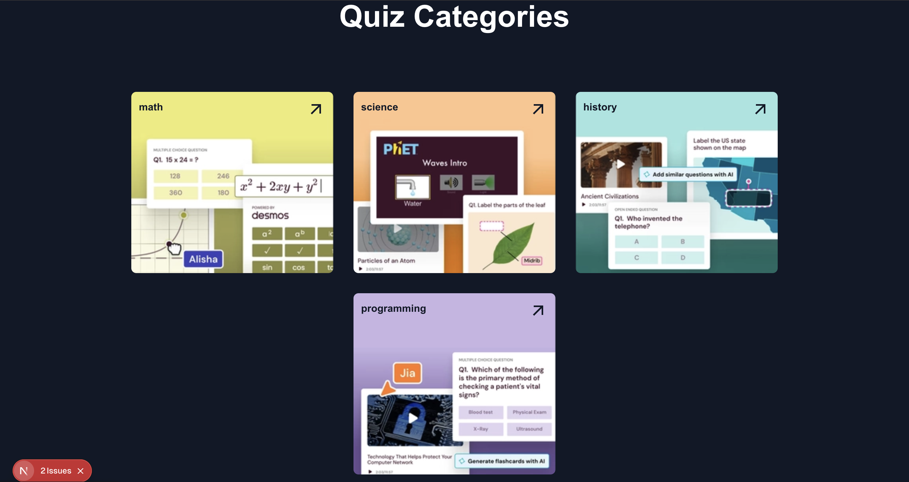

# Micro Quizz

This project is an interactive quiz application that displays one question at a time from various categories, tracks user answers with immediate feedback, and calculates the final score using Redux.

## Screenshots

## Tech Stack

#### Frontend

- [Next.js](https://nextjs.org/)
- [Typescript](https://www.typescriptlang.org/)
- [TailwindCSS](https://tailwindcss.com/)

# Configuration and running the Project

## Clone the project

<pre>
    git clone `https://github.com/anuprajvarma/micro-quizz.git`
</pre>

<pre>
    npm install

Set Envirement Variable

   NEXT_PUBLIC_BASE_URL=http://localhost:3000

run project

    npm run dev    
</pre>
